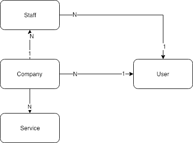
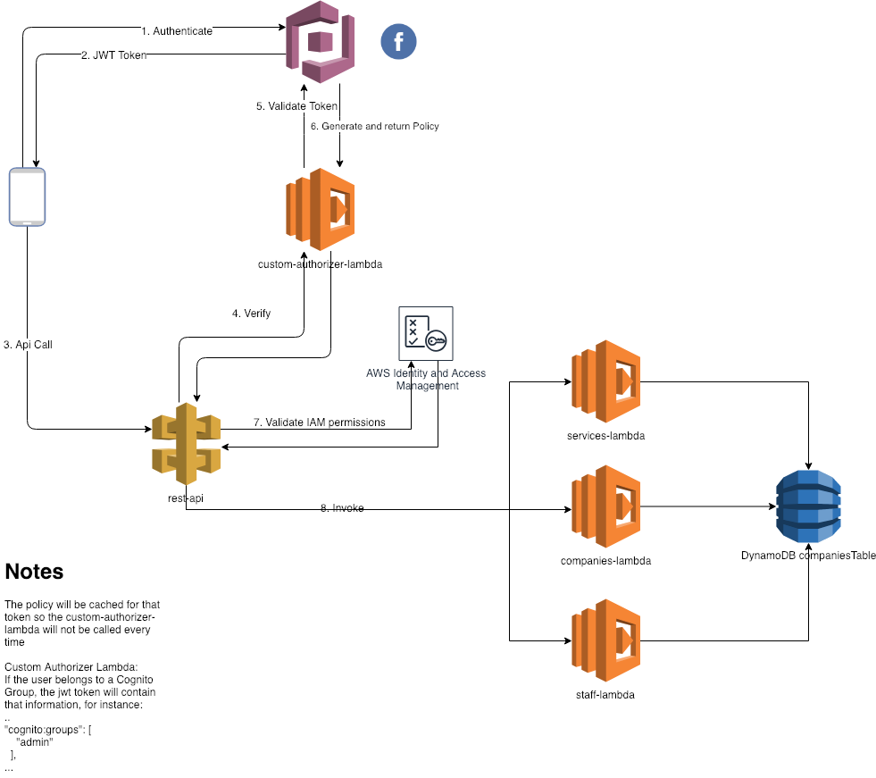

# Simple backend API using Cognito + AWS Lambdas (Golang) + DynamoDB + API Gateway + CloudFormation

## App Model

## Architecture

## Use Cases
  - Authentication using Cognito and Facebook

##### Companies Resource
  - Create Company for logged in User (POST /companies)
  - List User's Companies (GET /companies)
  - Get Company (GET /companies/{companyID})

##### Staff Resource
  - Create Company Staff (POST /companies/{companyID}/staff)

##### Services Resource
  - Create Company Services (POST /companies/{companyID}/services)

## Cloud Formation

We will create three different Stacks
  - cognito-stack.yml 
  - common-lambdas-stack.yml (it just contains the creation of the S3 bucket where we will deploy our lambdas and the custom-authorizer-lambda)
  - companies-stack.yml (Rest API + Roles + DynamoDB + Lambdas)

## Cognito and Facebook Configuration
We will create a cognito User Pool and 

## How data is stored in DynamoDB 
The way you design how to store the apps data in DynamoDB depends on how you access the data. 
Please, read [this article](https://docs.aws.amazon.com/amazondynamodb/latest/developerguide/HowItWorks.ReadWriteCapacityMode.html) to understand better.

In our case we use just a single table for all the entries and design the partition and sort key as follows:

#### Composite key: Partition Key + Sort Key

PartitionKey   |   SortKey   | Attributes

Comapny-[CompanyID] | Service-[ServiceID] | [UserSub]
[CompanyID] | [StaffID] | [UserSub]

Example

PartitionKey | SortKey | UserSub | DocType
------------ | ------------- | ------------- | -------------
Company-1234 | Company-1234 | agustin | Company
Company-5555 | Company-5555 | agustin | Company
Company-6666 | Company-6666 | agustin | Company
Company-1234 | Staff-0001 | john | Staff
Company-1234 | Staff-0002 | maria | Staff
Company-0012 | Company-0012 | maria | Company
Company-0012 | Staff-0001 | agustin | Staff

Now, what if we want to get all the companies for the user agustin? For that, we could just create a Global Secondary Index using the UserSub as the PartitionKey:

Golbal Secondary Index

PartitionKey (UserSub) | SortKey (Same SortKey) | CompanyID | ...
------------ | ------------- | ------------ | ------------- 
agustin | Company-1234  | ...
agustin | Company-5555  | ...
agustin | Company-6666  | ...
john | Staff-0001 | ...
maria | Staff-0002 | ...
agustin | Staff-0001  | ...
